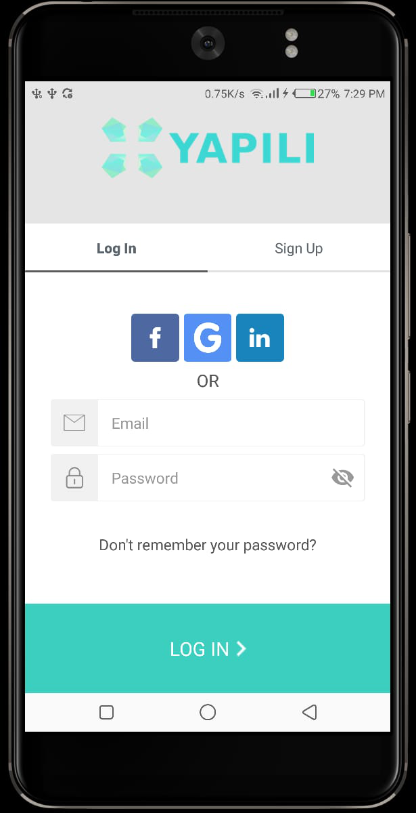
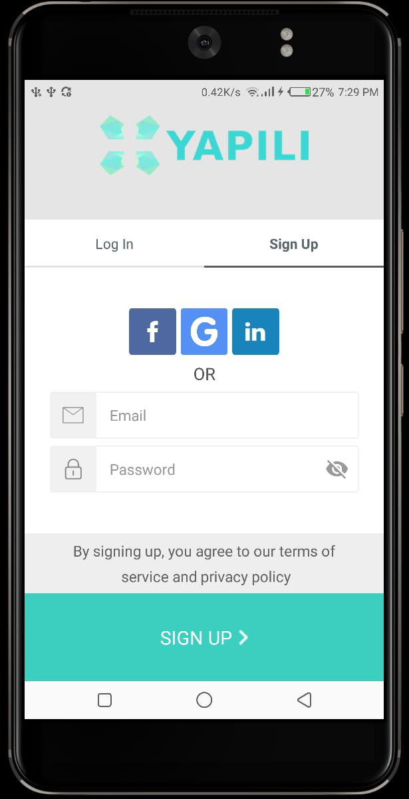
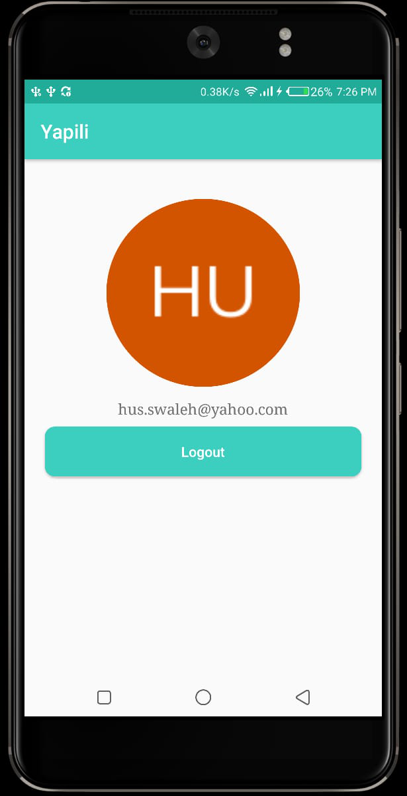

# Auth0-Yapili-App
Auth0-Yapili-App is an application that implements the Auth0 SDK for user authetication. Tha application allow for both user sign in and sign up using:

* Email and passoword
* Facebook
* LinkedIn
* Gmail

The application uses Auth0 SDK's UI known as **Lock** to render the Ui for user signin/signup activities.
Auth0 offers **widgets** and **SDKs** that provide a simple and frictionless experience for developers for authnrication.

## Prerequisites
You will need the following to run this project:

+ A laptop or desktop machine with internet access
+ Android Studio (Latest Stable Release)

## Setting Up
+ Clone the Repository from Github
+ Open the project folder using Android Studio IDE

### Sign In Screen
When the application is launched, the first screen that is presented to the user is the logIn/SignUp screen. A user will have a variety of login/signup option to use.

### Sign Up Screen
The user can also sign up to the application from any of the options seen in the image below:

### User Information Screen
On successful signin, the user is redirected to a screen which displays his/her account details. From this screen, the user can logout by pressing the logout button.

